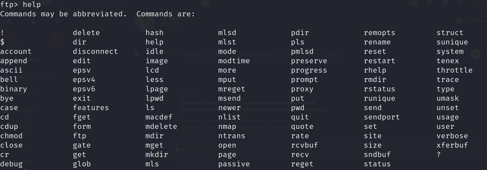

# Intro to CTFs

### Challange 1: Scavenger Hunt (PicoCTF)

> This challange is a good start in web challanges

##### The solution
- first, I examined the source code and found the first part of the flag 
- Within the source code you will find a css file and js file named **mycss.css** and **myjs.js**
- In the css file i found the second part of the flag
- In the js file i found no flags, but i found a good hint *How can I keep Google from indexing my website?*
- This hint moves us to think about **robots.txt** file so let's go to this endpoint
- At **robots.txt** we found the third part of the flag and another hint
- The hint says *I think this is an apache server* this moves us to **.htaccess**
- At **.htaccess** we found the forth part of the flag and another hint
- The hint refers to using MAC for making the website and storing information there
- After search the file is called **.DS_Store** when you go to it u will find the last part of the flag
- C0ngr4tzzzzzzz

> We can use directory bruteforcing to reach *robots.txt*, *.htaccess* and *.DS_Store*

### Challange 2: catchtoka (CyberTalentsCTF)
- When u start the challange you will find a page with a message *SORRY , toka only talks German :)*
- This will make us think about the headers of the request
- after some search u will find that there's a header in the request called **Accept-Language** whose value is **en-US,en**
- let's change it to **de** and it works !!

- C0ngr4tzzzzzzz

### Challange 3: who am i? (CyberTalentsCTF)
- When u start the challange you will find a login page but we don't have any credentials
- When u view the source page you will find the credentials. Use them to sign in
- A page with message *Access Denied. You have no admin priviliges, Please login with an administrator account* appeared
- After examining the site i found interesting cookie Authentication
- We can note that it's URL encoded and BASE64 encode
- We can decode it using cyberchef and we will find it became **login=Guest**
- What if we change it to **login=admin** and decode it
- U got the flag

- C0ngr4tzzzzzzz

### Challange 4: Basic Injection (CTFLearn)
- When u start the challange you will find an input vector to search in the database and the query is mentioned also
- The query is *SELECT * FROM webfour.webfour where name = '$input'*
- We see that the input isn't sanitized so we can inject **' or 1=1 #**
- The whole table is dumped

- C0ngr4tzzzzzzz

### Starting Point Machine: Fawn (HackTheBox)
- Start the vpn and spawn the machine
- Scan for the open ports using **nmap -sV -sC -Pn machine ip**

- You will find **FTP** on port 21
- Also note that anonymous login is allowed
- So we can login with username: anonymous and any password
- When you login you can use **help** command to see available commands

- You can use dir or ls to list the files in the current directory
- You will find **flag.txt** file

- use the command **get** to get this file and the **cat** to read it's content
- C0ngr4tzzzzzzz